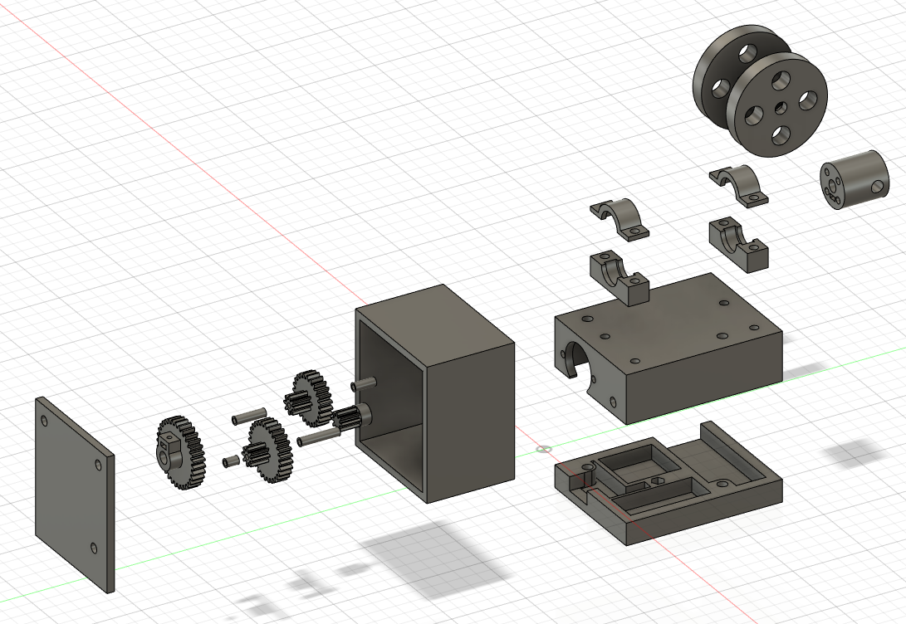
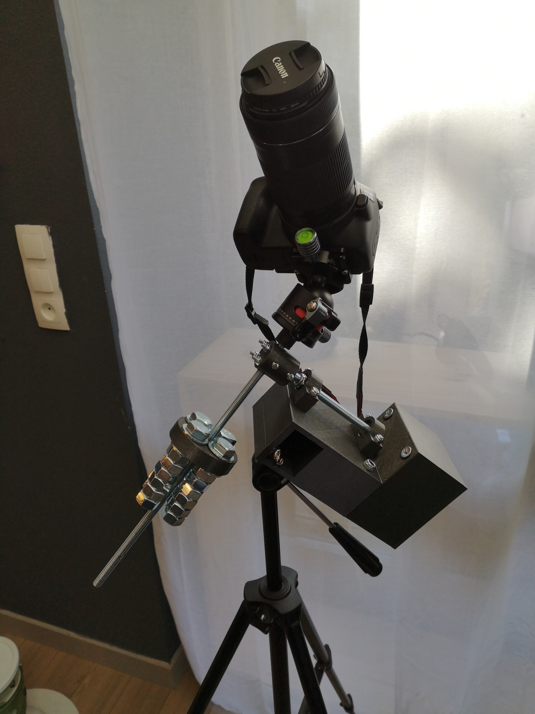
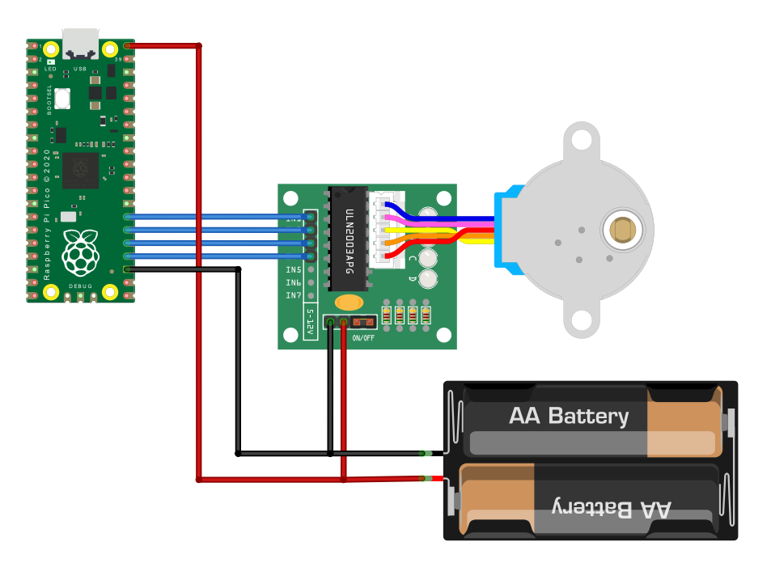
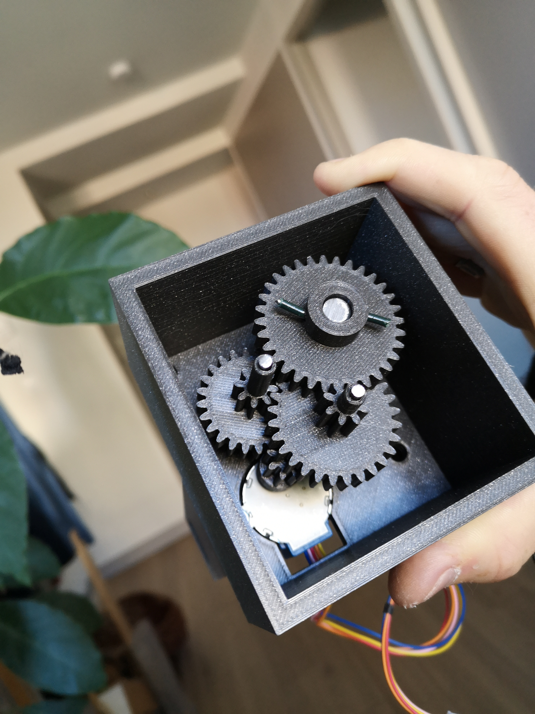
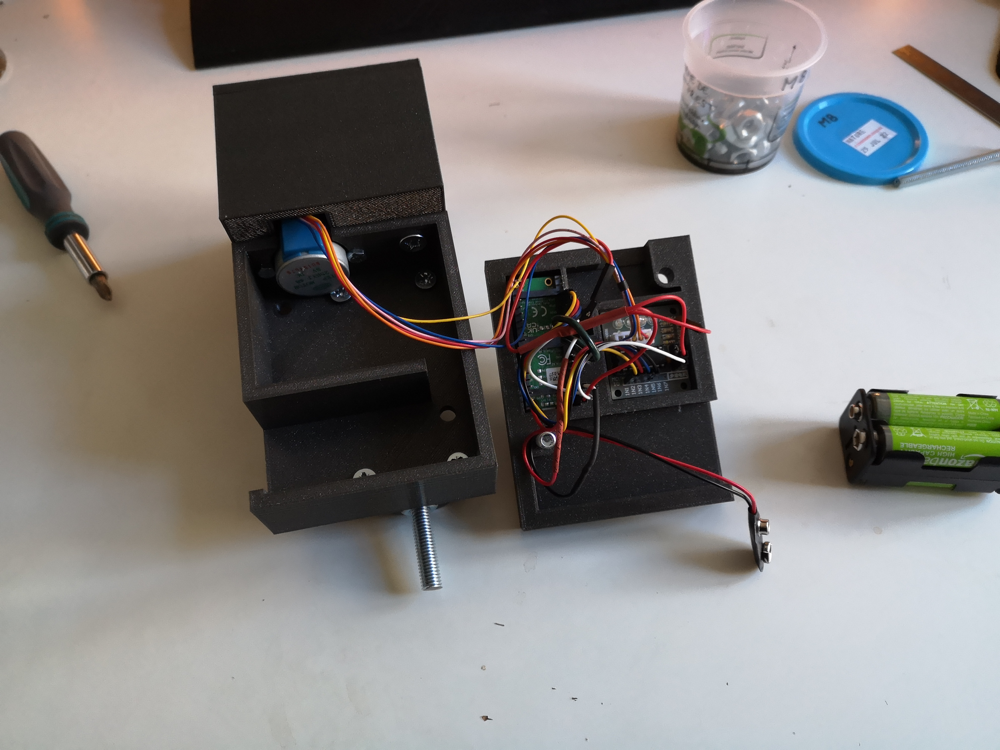
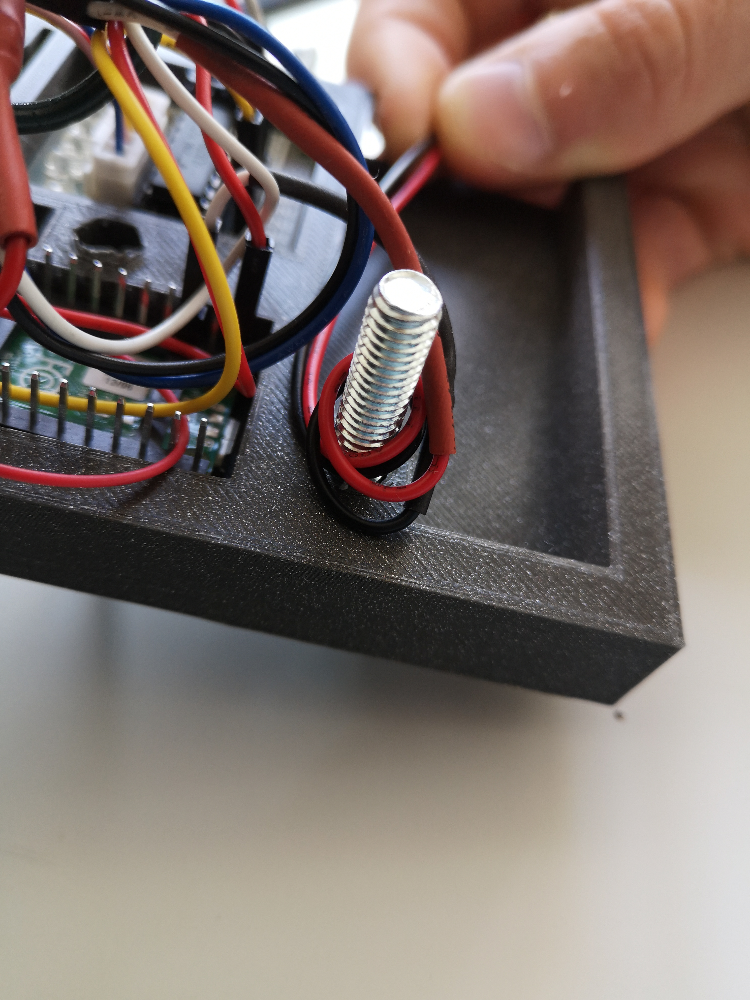
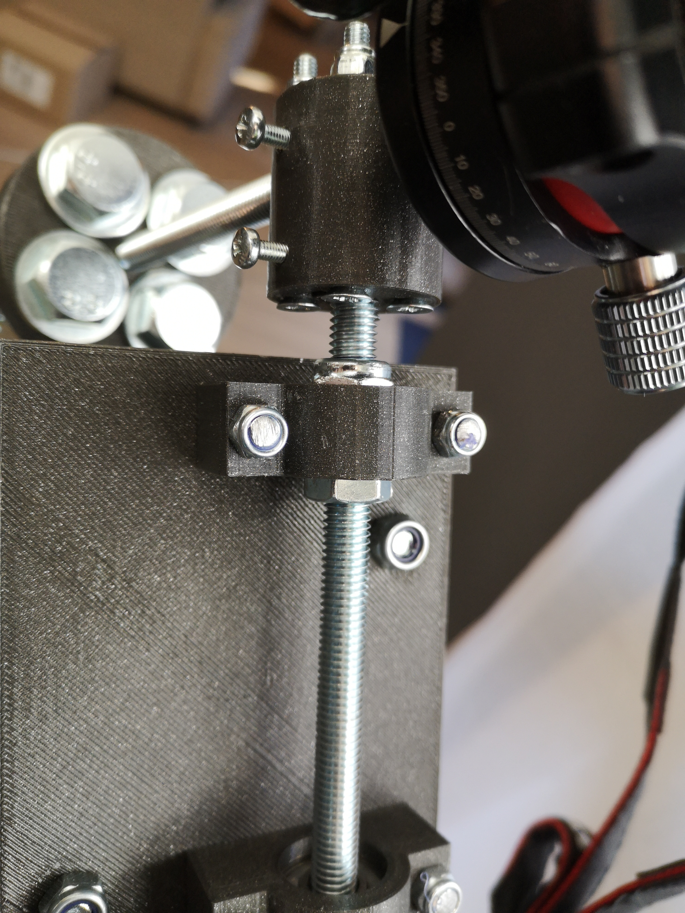

# DIY Motorized Equatorial Mount

This project will guide you to create your own DIY Motorized Equatorial Mount controlled over wifi.

We will use a `28BYJ-48 stepper motor` coupled with a `1:42` reduction gear ratio, controlled by a `Raspberry Pico W`.
It'll be powered by `4xAA 1.2v Ni-MH rechargeable battery`.
> [!WARNING]
>_Do **not** use other battery than Ni-MH, since their voltage can be higher and damage your `Raspberry Pico W`._

  
&nbsp;
  

## Item list
| Electronics | Case | Axis | Counterweight | Bearings |
| :---: | :---: | :---: | :---: | :---: |
| x1 Raspberry Pico W | x1 M6 bolt (80mm) | x1 M8 threaded Rod (500mm) | x1 M8 nut | x4 M5 bolt (30mm) |
| x1 28BYJ-48 stepper motor | x2 M6 bolt (70mm) | x2 M8 self-locking nut | x4 M12 screw (80mm) | x2 Skate bearing ABEC 7 |
| x1 ULN2003 driver board | x2 M6 bolt (50mm) | x4 M4 bolt (40mm) | x24 M12 nut | - |
| x1 4xAA case | x2 M4 bolt (20mm) | x2 M3 bolt (20mm) | - | - |
| Jumper wires | x1 M4 screw (40mm) | x1 M3 bolt (16mm) | - | - |
| - | x1 M4 wing nut | x2 nail (70mm x 3mm diameter) | - | - |

> [!NOTE]
>_This build requires some additional tools:_
> - _A metal saw to cut the M8 threaded Rod_
> - _A soldering iron to connect the power source to the Raspberry Pico W and the Motor driver board_

## Printing instructions
Print all the 3D files located in the [3dPrints](./misc/3dPrints/) folder.
All the files are already correctly oriented for printing, and are designed to use the smallest amount of supports as possible.
I printed these with an Ender-3 Pro, 0.4mm nozzle, layer height 0.2mm and with gyroid infill set to around 20% to 40%.
Some files needs to be printed multiple time, here is a list of pieces you should end up with:
| Count | Piece | Infill | Need supports |
| :---: | :---: | :---: | :---: |
| 1 | AxisMount-MEM-MK2 | 30% | Yes |
| 2 | BearingBottom-MEM-MK2 | 40% | No |
| 2 | BearingTop-MEM-MK2 | 40% | Yes |
| 2 | Counterweight-MEM-MK2 | 20% | No |
| 1 | Gear8-24-MEM-MK2 | 40% | No |
| 1 | Gear8-28-MEM-MK2 | 40% | No |
| 1 | Gear8-MEM-MK2 | 40% | No |
| 1 | Gear32-MEM-MK2 | 40% | No |
| 1 | GearSpacer8mm-MEM-MK2 | 40% | No |
| 1 | GearSpacer14mm-MEM-MK2 | 40% | No |
| 1 | GearSpacer20mm-MEM-MK2 | 40% | No |
| 1 | GearSpacer26mm-MEM-MK2 | 40% | No |
| 1 | GearCaseBottom-MEM-MK2 | 20% | No |
| 1 | GearCaseTop-MEM-MK2 | 20% | No |
| 1 | MainCaseBottom-MEM-MK2 | 20% | No |
| 1 | MainCaseTop-MEM-MK2 | 20% | Yes |

## Electrical diagram

## Assembly instructions
- Place the `Skate bearings` between `BearingTop` & `BearingBottom` pieces. Then mount them on the `MainCaseTop` with `x4 M5 bolt (30mm)`.
- Assemble the `Gear8` and the `motor` together.
- Place the `motor` inside the `GearCaseBottom`, put the `GearCaseBottom` on the side of `MainCaseTop` and screw them together with `x2 M4 bolt (20mm)`.
- Cut a 200mm piece from the `M8 threaded Rod`. We'll refer to it as the `main axis`. (Tip: You can easily cut a screw/rod without damaging it: screw some nuts near the spot you want to cut, clamp these nuts to a steady surface and cut your screw/rod)
- Put the `Gear32` at the very end of the `main axis` and secure it with a `x1 M3 bolt (16mm)`.
- Slide the `main axis` inside the bearings with the gear nearly inside the `GearCaseBottom` top. Secure it with `x2 M8 self-locking nut` by tightening the two nuts with a bearing between. (See [Gallery](#Gallery))
- Cut both ends of the `x2 nail (3mm diameter)` to a height of 60mm. These will serve as our intermediate gears' axes.
- Mount the `GearSpacer14mm`-`Gear8-24`-`GearSpacer20mm` on one of these axis, and put it inside the `GearCaseBottom`, in the furthest notch from the motor. (Tip: You can put some Blu-Tack inside the notch to help the axis standing while you assemble the whole thing)
- Repeat the process with the `GearSpacer26mm`-`Gear8-28`-`GearSpacer8mm`, in the nearest notch from the motor this time.
- Put the `GearCaseTop` on the `GearCaseBottom`, then secure it with `x2 M6 bolt (70mm)` and `x1 M6 bolt (80mm)`. (Make sure both intermediate gears axis are secured in their respective notch)
- Add `x4 M4 bolt (40mm)` to the `AxisMount`. (These are only here to secure the camera if the piece break)
- Mount the `AxisMount` on the `main axis` and secure it with `x1 M3 bolt (20mm)`.
- Cut a 300mm piece from the `M8 threaded Rod`. We'll refer to it as the `secondary axis`. (This axis will handle the camera and the counterweight)
- Mount the `secondary axis` on the `AxisMount` and secure it with `x1 M3 bolt (20mm)`.
- Put the `Raspberry Pico W` and the `ULN2003 driver board` inside the `MainCaseBottom`.
- Add `x1 M4 screw (40mm)` in the center hole. This will be used as a mounting screw on a tripod with the `x1 M4 wing nut`.
- Flash the `Raspberry Pico W` with [this binary](./misc/release/motorized_equatorial_mount.uf2).
- Connect all the electronics together (See the [electrical diagram](#electrical-diagram) above).
- Assemble the `MainCaseBottom` to the `MainCaseTop` with `x2 M6 bolt (50mm)`. (I highly suggest you to wrap the `4xAA case` wires around the screw)
- Put `x1 M8 nut` between the two `Counterweight` pieces and screw them together with `x4 M12 screw (80mm)` and `x24 M12 nut`. (You can put more or less nuts to customize your counterweight)
- You can now mount your camera on the `secondary axis` with an M8 to 1/4" adapter, for exemple, and screw the counterweight on the other side to balance it.

## User instructions
- Plug your 4xAA to the Motorized Equatorial Mount.
- Connect your phone to the wifi access point named `equatorial mount` (by default the password is `polar-star`). Open your browser and go to `192.168.4.1`
- You can now control the motor direction & speed from the web page. **The preset speed of 501ms between each motor step should be good to track stars if you use the same gear ratio & motor as mentioned in the Item list.**
- Unplug your 4xAA batteries to power down the system.
- Remove your camera and counterweight when not in use to prevent stress on the gears.

## Gallery

  
&nbsp;
  

  
&nbsp;
  

